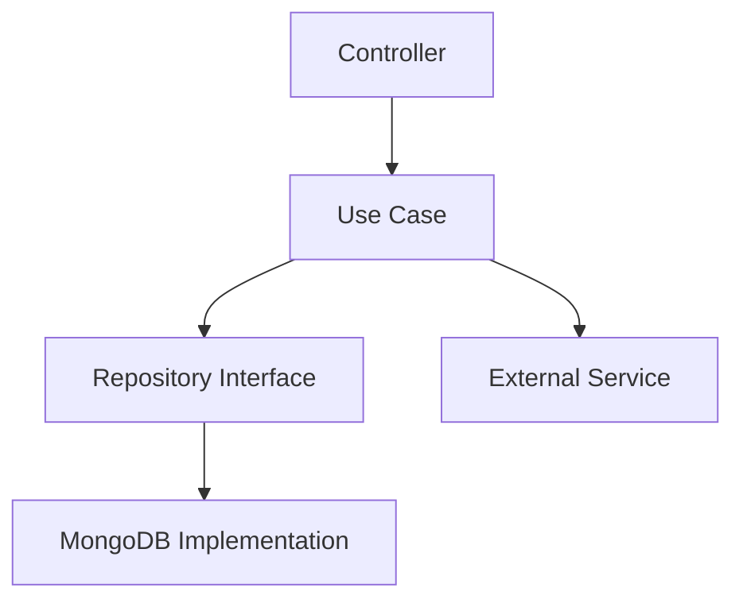

# Page Templates

Ready-to-use templates for common documentation page types. Copy, customize, and add to `docs.json` navigation.

## Guide Page

```mdx
---
title: "Feature Name Guide"
description: "Learn how to use Feature Name to accomplish X"
icon: "book-open"
---

Brief introduction: what this guide covers and who it's for.

## Prerequisites

<Info>
  Before you begin, make sure you have:
  - Prerequisite 1
  - Prerequisite 2
</Info>

## Step-by-step

<Steps>
  <Step title="First step">
    Instruction for step 1.

    ```bash
    example command
    ```
  </Step>
  <Step title="Second step">
    Instruction for step 2.
  </Step>
  <Step title="Verify">
    How to confirm everything works.
  </Step>
</Steps>

## What's next

<CardGroup cols={2}>
  <Card title="Related Guide" icon="arrow-right" href="/guides/related">
    Continue with the next guide.
  </Card>
  <Card title="API Reference" icon="terminal" href="/api-reference/endpoint">
    See the API details for this feature.
  </Card>
</CardGroup>
```

## Architecture / Technical Page

```mdx
---
title: "Module Architecture"
description: "Technical overview of the Module subsystem"
icon: "sitemap"
mode: "wide"
---

## Overview

Brief paragraph on what this module does and its role in the system.

## Architecture Diagram



## Key Components

| Component | Responsibility | Location |
|-----------|---------------|----------|
| Controller | HTTP handling | `src/modules/name/controller.ts` |
| Use Case | Business logic | `src/modules/name/usecases/` |
| Repository | Data access | `src/modules/name/repository.mongo.ts` |

## Data Model

<Expandable title="Entity fields">
  <ParamField body="id" type="string" required>
    UUID v4 unique identifier.
  </ParamField>
  <ParamField body="name" type="string" required>
    Display name (max 100 chars).
  </ParamField>
  <ParamField body="createdAt" type="Date">
    ISO 8601 timestamp. Auto-generated.
  </ParamField>
</Expandable>

## Key Patterns

<AccordionGroup>
  <Accordion title="Pattern Name">
    Description of the pattern and why it's used.
  </Accordion>
</AccordionGroup>
```

## API Reference Introduction

```mdx
---
title: "API Reference"
description: "Complete reference for the Project API"
icon: "terminal"
---

## Base URL

<Tabs>
  <Tab title="Production">
    ```
    https://api.yourdomain.com
    ```
  </Tab>
  <Tab title="Development">
    ```
    http://localhost:3001
    ```
  </Tab>
</Tabs>

## Authentication

All API endpoints require a Bearer token in the `Authorization` header:

```bash
curl -H "Authorization: Bearer YOUR_TOKEN" \
  https://api.yourdomain.com/api/endpoint
```

<Note>
  Get your token by calling `POST /api/users/login` with valid credentials.
</Note>

## Response Format

All responses follow a standard envelope:

<Tabs>
  <Tab title="Success">
    ```json
    {
      "success": true,
      "data": { ... }
    }
    ```
  </Tab>
  <Tab title="Error">
    ```json
    {
      "success": false,
      "error": "Human-readable error message"
    }
    ```
  </Tab>
  <Tab title="List with pagination">
    ```json
    {
      "success": true,
      "data": [...],
      "total": 100,
      "pagination": {
        "page": 1,
        "limit": 10,
        "totalPages": 10
      }
    }
    ```
  </Tab>
</Tabs>

## Rate Limiting

<Warning>
  API requests are limited to **100 requests per minute** per IP address.
  Exceeding this limit returns a `429 Too Many Requests` response.
</Warning>

## Explore Endpoints

<CardGroup cols={2}>
  <Card title="Users" icon="users" href="/api-reference/users">
    User management and authentication.
  </Card>
  <Card title="Billing" icon="credit-card" href="/api-reference/billing">
    Subscription and payment management.
  </Card>
</CardGroup>
```

## Changelog Entry

```mdx
---
title: "v1.2.0"
description: "Release notes for version 1.2.0"
date: "2026-02-23"
---

## What's New

<CardGroup cols={1}>
  <Card title="Feature Name" icon="sparkles">
    Description of the new feature and its benefits.
  </Card>
  <Card title="Another Feature" icon="zap">
    Description of another new feature.
  </Card>
</CardGroup>

## Improvements

- Improved performance of endpoint X by 40%
- Updated error messages for better clarity

## Bug Fixes

- Fixed issue where Y would fail under Z conditions
- Resolved edge case in authentication flow

## Breaking Changes

<Warning>
  The `oldField` parameter on `POST /api/resource` has been renamed to `newField`.
  Update your integrations before upgrading.
</Warning>
```

## FAQ / Troubleshooting Page

```mdx
---
title: "FAQ"
description: "Frequently asked questions and troubleshooting"
icon: "circle-help"
---

## General

<AccordionGroup>
  <Accordion title="Question one?">
    Answer to question one.
  </Accordion>
  <Accordion title="Question two?">
    Answer to question two.
  </Accordion>
</AccordionGroup>

## Troubleshooting

<AccordionGroup>
  <Accordion title="Error: Something went wrong">
    **Cause:** Description of root cause.
    
    **Solution:**
    1. Step one
    2. Step two
    3. Verify the fix
  </Accordion>
</AccordionGroup>
```
