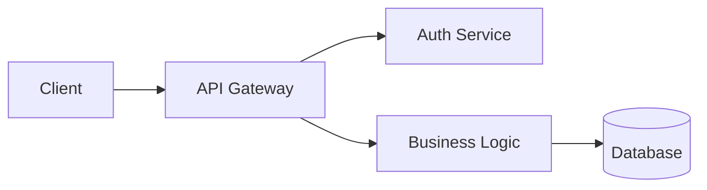

# Components Reference

## Table of Contents
- [Page Frontmatter](#page-frontmatter)
- [Callouts](#callouts)
- [Cards and Navigation](#cards-and-navigation)
- [Steps](#steps)
- [Tabs](#tabs)
- [Accordions](#accordions)
- [Code Blocks and Groups](#code-blocks-and-groups)
- [Expandables and Fields](#expandables-and-fields)
- [Frames](#frames)
- [Tooltips](#tooltips)
- [Mermaid Diagrams](#mermaid-diagrams)
- [Columns](#columns)
- [Icons](#icons)
- [Badge](#badge)
- [Reusable Snippets](#reusable-snippets)

## Page Frontmatter

Every `.mdx` page starts with YAML frontmatter:

```yaml
---
title: "Page Title"              # Required
description: "SEO description"   # Required
icon: "rocket"                   # Optional: Lucide icon name
mode: "default"                  # Optional: "default" | "wide" | "custom"
sidebarTitle: "Short Title"      # Optional: override sidebar label
---
```

**Page modes:**
- `default` — Standard centered content
- `wide` — Full-width content area (good for tables, dashboards)
- `custom` — No default styling

## Callouts

Emphasize important information:

```mdx
<Note>Informational note — general context.</Note>
<Tip>Helpful suggestion — best practice or shortcut.</Tip>
<Warning>Caution — potential issues or breaking changes.</Warning>
<Info>Contextual info — background or prerequisites.</Info>
```

**When to use each:**
- `<Note>` — Default for supplementary context
- `<Tip>` — Recommendations, shortcuts, best practices
- `<Warning>` — Breaking changes, security concerns, destructive actions
- `<Info>` — Prerequisites, requirements, version constraints

## Cards and Navigation

**Single card** (horizontal link):
```mdx
<Card title="Quickstart" icon="rocket" href="/guides/quickstart" horizontal>
  Get up and running in 5 minutes.
</Card>
```

**Card grid** (2-4 columns):
```mdx
<CardGroup cols={2}>
  <Card title="Feature A" icon="star" href="/guides/feature-a">
    Description of feature A.
  </Card>
  <Card title="Feature B" icon="zap" href="/guides/feature-b">
    Description of feature B.
  </Card>
</CardGroup>
```

**Props:**
- `title` — Card heading (required)
- `icon` — Lucide icon name (optional)
- `href` — Link destination (optional)
- `horizontal` — Side-by-side layout (optional flag)
- `cols` — CardGroup: columns (1-4, default 2)

## Steps

Numbered sequential instructions:

```mdx
<Steps>
  <Step title="Install dependencies">
    ```bash
    npm install @fastify/swagger
    ```
  </Step>
  <Step title="Configure the plugin">
    Add to your server setup:
    ```typescript
    await server.register(swagger, { ... });
    ```
  </Step>
  <Step title="Verify">
    Visit `http://localhost:3000/documentation` to see the Swagger UI.
  </Step>
</Steps>
```

## Tabs

Show alternative content (e.g., different languages, concepts):

```mdx
<Tabs>
  <Tab title="npm">
    ```bash
    npm install package-name
    ```
  </Tab>
  <Tab title="pnpm">
    ```bash
    pnpm add package-name
    ```
  </Tab>
  <Tab title="yarn">
    ```bash
    yarn add package-name
    ```
  </Tab>
</Tabs>
```

## Accordions

Collapsible sections for optional details:

```mdx
<AccordionGroup>
  <Accordion title="How do I reset my password?">
    Navigate to **Settings** → **Security** → **Change Password**.
  </Accordion>
  <Accordion title="What are the rate limits?">
    100 requests per minute per API key.
  </Accordion>
</AccordionGroup>
```

Use `<Accordion>` alone (without group) for a single collapsible.

## Code Blocks and Groups

**Single code block with title:**
````mdx
```typescript server.ts
const server = Fastify({ logger: true });
```
````

**Multi-language code group:**
````mdx
<CodeGroup>
  ```bash npm
  npm install package
  ```
  ```bash pnpm
  pnpm add package
  ```
  ```bash yarn
  yarn add package
  ```
</CodeGroup>
````

**Code block features:**
- Language identifier after opening backticks for syntax highlighting
- Filename after language for a title tab (e.g., `` ```ts server.ts ``)
- Line highlighting: Not natively supported — use callouts to reference lines

## Expandables and Fields

For documenting API parameters:

```mdx
<ParamField path="userId" type="string" required>
  The unique identifier of the user.
</ParamField>

<ParamField query="limit" type="integer" default="10">
  Maximum number of results to return.
</ParamField>

<Expandable title="Nested properties">
  <ParamField body="address.street" type="string">
    Street address line.
  </ParamField>
  <ParamField body="address.city" type="string">
    City name.
  </ParamField>
</Expandable>
```

**ParamField locations:** `path`, `query`, `body`, `header`

## Frames

Add visual emphasis around images:

```mdx
<Frame>
  
</Frame>
```

Use `<Frame caption="Figure 1: Dashboard">` for captioned images.

## Tooltips

Inline hover definitions:

```mdx
The <Tooltip tip="JavaScript Object Notation">JSON</Tooltip> response format is used throughout the API.
```

## Mermaid Diagrams

Create diagrams directly in MDX using fenced code blocks:

````mdx

````

Supports: flowcharts, sequence diagrams, class diagrams, ER diagrams, Gantt charts. Full syntax: [mermaid-js.github.io](https://mermaid-js.github.io/).

## Columns

Side-by-side content:

```mdx
<Columns cols={2}>
  <div>
    **Left column content** — explanatory text.
  </div>
  <div>
    ```json
    { "example": "code" }
    ```
  </div>
</Columns>
```

## Icons

Mintlify uses [Lucide icons](https://lucide.dev/icons/). Reference by name:

```mdx
<Icon icon="check" /> Task completed
<Icon icon="x" /> Task failed
```

Common icons: `rocket`, `terminal`, `book-open`, `code`, `settings`, `users`, `shield`, `database`, `globe`, `zap`, `star`.

## Badge

Inline labels:

```mdx
<Badge>New</Badge>
<Badge color="green">Stable</Badge>
<Badge color="yellow">Beta</Badge>
<Badge color="red">Deprecated</Badge>
```

## Reusable Snippets

Create reusable MDX fragments in the `snippets/` directory:

```mdx
{/* snippets/auth-note.mdx */}
<Note>
  All API endpoints require a valid Bearer token in the `Authorization` header.
  See [Authentication](/guides/authentication) for details.
</Note>
```

Import in any page:

```mdx
import AuthNote from '/snippets/auth-note.mdx';

<AuthNote />
```

**Best for:** Repeated warnings, shared setup instructions, standard disclaimers.
